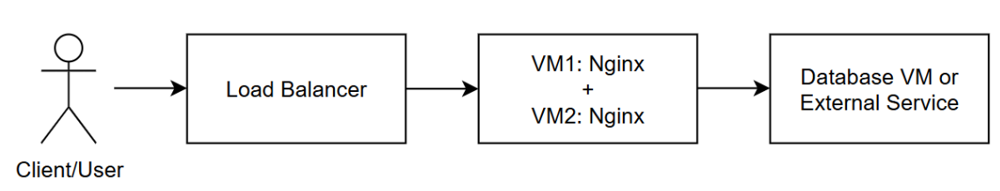
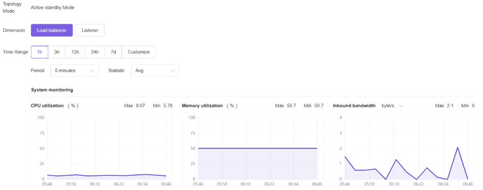
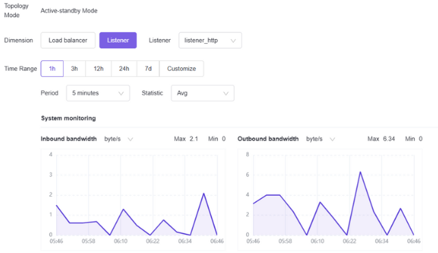

# EasyStack Load Balancer Project

## 1. Introduction

A **load balancer** acts as a smart traffic controller for web applications. Instead of directing all client requests to a single server, it provides a single entry point and distributes incoming traffic across multiple backend servers.

This approach improves **availability**, ensures **workload distribution**, and allows servers to be added or maintained without service interruption.

---

## 2. Background, Goal, and Objectives

### Background

* A single web server represents a **single point of failure**.
* Standalone servers cannot handle large-scale traffic efficiently.

### Project Goal

Deploy an **EasyStack Load Balancer** in front of two Nginx backend servers to provide a highly available and scalable web service.

### Objectives

* Ensure external access through one public IP.
* Distribute traffic evenly between backend servers.
* Monitor backend health and automatically remove failed servers.

---

## 3. Architecture Overview

The load balancer sits at the front, routing client requests to the backend servers based on the configured balancing algorithm.

---

## 4. Tools and Environment

* **Platform:** EasyStack
* **Resources:** Two Ubuntu 22.04 VMs running Nginx
* **Network:** Shared subnet with floating IP for external access

| VM                 | AZ   | Image        | Flavor            | Network    | Floating IP    | Bandwidth |
| ------------------ | ---- | ------------ | ----------------- | ---------- | -------------- | --------- |
| VM1 (instance-lb1) | az-2 | Ubuntu 22.04 | 2C / 2GiB / 10GiB | share\_net | 103.153.184.91 | 20 Mbps   |
| VM2 (instance-lb2) | az-2 | Ubuntu 22.04 | 2C / 2GiB / 10GiB | share\_net | 103.153.184.95 | 20 Mbps   |

---

## 5. Implementation Steps

1. **Provision two VMs** with Nginx installed.

   * Configure each server with a unique index page (e.g., “Server 1” and “Server 2”).
2. **Create a Load Balancer** in EasyStack.
3. **Configure Listener** on port 80 (HTTP).
4. **Create Pool** using the Round Robin method.
5. **Add Members**: instance-lb1 and instance-lb2.
6. **Enable Health Monitor** (HTTP 200 status check).
7. **Assign Floating IP** to the load balancer for external access.

### Load Balancer Configuration Summary

| Parameter             | Value                                                  |
| --------------------- | ------------------------------------------------------ |
| Name                  | loadbalancer\_thursday                                 |
| Availability Zone     | default-az                                             |
| Root Disk             | SSD (50 GiB)                                           |
| Flavor                | Tiny I (1C / 2GiB)                                     |
| VIP (Virtual IP)      | 172.19.1.231                                           |
| Floating IP           | 103.153.184.101                                        |
| Subnet                | share\_net\_\_subnet                                   |
| Backend Members       | instance-lb1 (172.19.1.94), instance-lb2 (172.19.1.99) |
| Load Balancing Method | Round Robin                                            |
| Health Monitor        | TCP / HTTP (port 80)                                   |

---

## 6. Monitoring and Test Results

* **System Monitoring Dashboard**
  

* **Listener-Level Traffic Monitoring**
  

* **Demo:**

  * Requests to the load balancer’s floating IP are alternately served by **Server 1** and **Server 2**.
  * The **floating IP** ensures external users can access the service via a single, stable address, regardless of backend server changes.

---

## 7. Conclusion

Deploying the EasyStack Load Balancer with Nginx backend servers demonstrates the following benefits:

* **High Availability:** Service remains online even if one VM fails.
* **Scalability:** Additional backend servers can be added with minimal effort.
* **Efficient Traffic Distribution:** Requests are evenly spread across servers.
* **Health Monitoring:** Failed servers are detected and removed automatically.

**Final Outcome:**
A functioning, load-balanced Nginx web service accessible through a single floating IP, ensuring reliability, scalability, and efficient resource utilization.

## 8. Future Improvements

While the current implementation demonstrates a functional and reliable load-balanced web service, several enhancements can be introduced to strengthen performance, security, and operational efficiency:

* **SSL/TLS Termination:** Configure the load balancer to handle HTTPS traffic, ensuring secure communication between clients and the service.
* **Autoscaling Integration:** Automate backend server scaling based on traffic load to optimize resource usage and maintain performance during demand spikes.
* **Session Persistence (Sticky Sessions):** Introduce session affinity for applications that require user requests to consistently reach the same backend server.
* **Logging and Monitoring Enhancements:** Integrate with centralized monitoring solutions (e.g., Prometheus, Grafana, ELK stack) for deeper visibility and alerting.
* **Disaster Recovery Setup:** Deploy redundant load balancers across multiple availability zones to ensure resilience against regional failures.
* **Application Firewall (WAF):** Add a security layer to filter malicious traffic and protect against common web threats.
